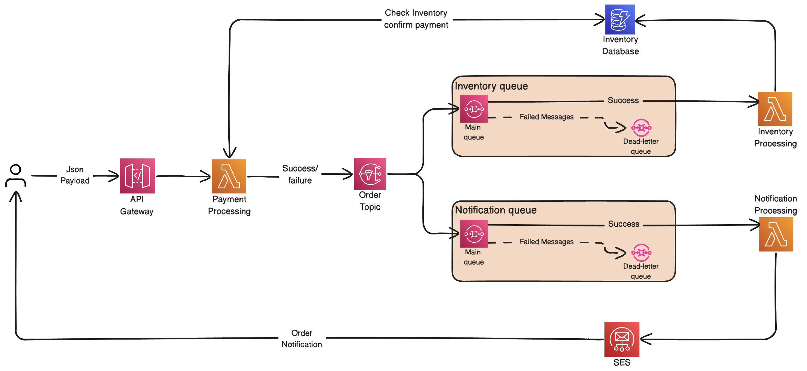

# Event-Driven Order Processing on AWS

An event-driven serverless demo built with AWS Lambda, API Gateway, SNS, SQS, SES, DynamoDB, and Terraform.

The project exposes a REST endpoint for order placement, validates and reserves inventory, fans out order events through SNS, stores inventory state in DynamoDB, and sends order notifications through Amazon SES.

## Architecture



## Tech Stack

- Terraform
- AWS API Gateway
- AWS Lambda (Python 3.11)
- Amazon SNS
- Amazon SQS
- Amazon DynamoDB
- Amazon SES

## Repository Layout

```text
Infrastructure/
  api_gateway.tf
  dynamoDB.tf
  lambda.tf
  provider.tf
  ses.tf
  sns.tf
  sqs.tf
  variables.tf

Scripts/
  common.py
  inventory_lambda.py
  notification_lambda.py
  order_events.py
  payment_lambda.py
  simulate_api_traffic.py
```

## What Each Lambda Does

- `process_payment_lambda`
  - Accepts API requests from API Gateway
  - Validates the payload
  - Atomically reserves inventory in DynamoDB
  - Publishes the order result to SNS

- `inventory_management`
  - Consumes confirmed-order events from SQS
  - Verifies the reservation already happened
  - Writes audit metadata back to DynamoDB

- `notification_lambda`
  - Consumes order result events from SQS
  - Sends confirmation or failure emails through SES

## Prerequisites

- AWS account
- Terraform `>= 1.3.0`
- AWS CLI configured
- Python 3.11
- `zip` installed locally

## Infrastructure Deployment

From the repository root:

```bash
terraform -chdir=Infrastructure init
terraform -chdir=Infrastructure plan
terraform -chdir=Infrastructure apply
```

## Lambda Packaging

This project currently uses simple zip artifacts placed at the repository root.

Build the deployment packages:

```bash
zip -j payment_lambda.zip Scripts/payment_lambda.py Scripts/common.py Scripts/order_events.py
zip -j inventory_lambda.zip Scripts/inventory_lambda.py Scripts/common.py
zip -j notification_lambda.zip Scripts/notification_lambda.py Scripts/common.py
```

If you rebuild the zip files after changing Python code, run:

```bash
terraform -chdir=Infrastructure apply
```

so Lambda picks up the updated `source_code_hash`.

## DynamoDB Seeding

The DynamoDB table uses:

- `product_id` as the partition key
- `stock` as the inventory count

Seed sample products with the AWS CLI:

```bash
aws dynamodb put-item \
  --region us-east-1 \
  --table-name inventory-table \
  --item '{
    "product_id": {"S": "prod-001"},
    "stock": {"N": "25"}
  }'
```

```bash
aws dynamodb put-item \
  --region us-east-1 \
  --table-name inventory-table \
  --item '{
    "product_id": {"S": "prod-002"},
    "stock": {"N": "10"}
  }'
```

```bash
aws dynamodb put-item \
  --region us-east-1 \
  --table-name inventory-table \
  --item '{
    "product_id": {"S": "prod-003"},
    "stock": {"N": "3"}
  }'
```

Verify the data:

```bash
aws dynamodb scan \
  --region us-east-1 \
  --table-name inventory-table
```

## SES Setup

For this project, the sender email is configured through Terraform in `Infrastructure/variables.tf`.

Verify the sender email:

```bash
aws ses verify-email-identity \
  --region us-east-1 \
  --email-address YOUR_SENDER@gmail.com
```

If your SES account is still in the sandbox, you must also verify recipient emails:

```bash
aws ses verify-email-identity \
  --region us-east-1 \
  --email-address recipient@example.com
```

Important:

- Sender verification is always required
- In SES sandbox mode, recipient verification is also required
- Production access is required to send to arbitrary recipient addresses

## API Testing

The API resource path is:

```text
/prod/order
```

Replace the hostname with your deployed API Gateway URL.

### Successful Order

```bash
curl -X POST "https://YOUR_API_ID.execute-api.us-east-1.amazonaws.com/prod/order" \
  -H "Content-Type: application/json" \
  -d '{
    "request_id": "req-1001",
    "product_id": "prod-001",
    "quantity": 1,
    "amount": 120,
    "email": "recipient@example.com"
  }'
```

Expected response:

```json
{
  "message": "Order processed",
  "order_id": "ord-req-1001",
  "event_type": "OrderConfirmed",
  "reason": null
}
```

### Payment Failure Scenario

Any amount greater than or equal to `1000` is rejected by the payment Lambda.

```bash
curl -X POST "https://YOUR_API_ID.execute-api.us-east-1.amazonaws.com/prod/order" \
  -H "Content-Type: application/json" \
  -d '{
    "request_id": "req-1002",
    "product_id": "prod-001",
    "quantity": 1,
    "amount": 1500,
    "email": "recipient@example.com"
  }'
```

### Out-of-Stock Scenario

Use a quantity larger than the available stock in DynamoDB.

```bash
curl -X POST "https://YOUR_API_ID.execute-api.us-east-1.amazonaws.com/prod/order" \
  -H "Content-Type: application/json" \
  -d '{
    "request_id": "req-1003",
    "product_id": "prod-003",
    "quantity": 10,
    "amount": 100,
    "email": "recipient@example.com"
  }'
```

## Observability and Debugging

Tail Lambda logs:

```bash
aws logs tail /aws/lambda/process_payment_lambda --region us-east-1 --since 30m
aws logs tail /aws/lambda/inventory_management --region us-east-1 --since 30m
aws logs tail /aws/lambda/notification_lambda --region us-east-1 --since 30m
```

Check queue depth:

```bash
aws sqs get-queue-attributes \
  --region us-east-1 \
  --queue-url https://sqs.us-east-1.amazonaws.com/YOUR_ACCOUNT_ID/notification-queue \
  --attribute-names ApproximateNumberOfMessages ApproximateNumberOfMessagesNotVisible
```

## Notes

- `process_payment_lambda` performs the inventory reservation atomically in DynamoDB
- `inventory_management` writes audit metadata after reservation succeeds
- Notification delivery is asynchronous, so the API can return success before the email arrives
- If SES is sandboxed, only verified recipients will receive emails

## License

This project is licensed under the terms of the [LICENSE](LICENSE) file.
